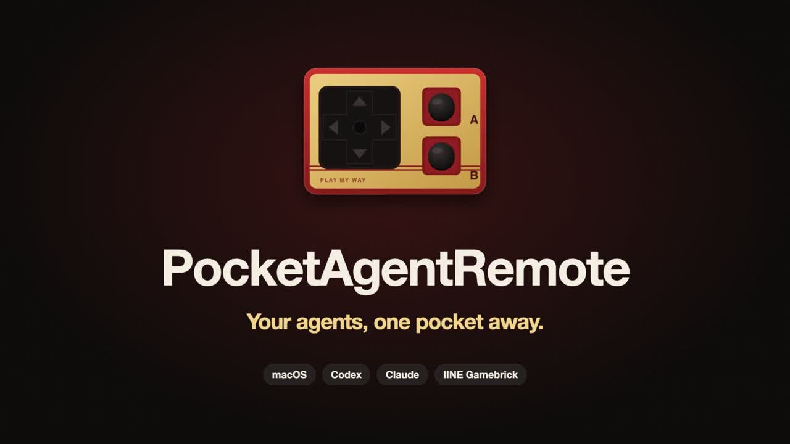
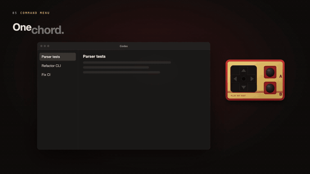

# PocketAgentRemote

把手柄（IINE 良值 L1162）变成 macOS 上 **Codex 桌面 App / Claude 桌面 App** 的遥控器。

<p align="center">
  <a href="docs/media/intro-720p.mp4"></a><br>
  <b>Your agents, one pocket away.</b><br>
  ▶ <a href="docs/media/intro-720p.mp4">107 秒介绍视频</a>（英文解说 + 字幕，覆盖全部功能；竖屏版与源码见 <a href="promo/README.md"><code>promo/</code></a>）
</p>

> 当前生效的规格：`docs/spec-v0.3.md`
> Phase 0 硬件实测：`docs/phase0-summary.md` · Phase 1 真机验证：`docs/phase1-verification.md`
> **需要你亲自测的项：`docs/test-manual.md`**（2026-09-18 批次）· 更早的：`docs/pending-user-tests.md`
> 路线图与执行计划：`docs/ux-roadmap.md`

---

## 功能一览

手柄只有六个键：↑↓←→、A、B。B 是修饰键。下面是现在能做的事，按使用频率排：

| 你做什么 | 发生什么 |
|---|---|
| 方向键 | 在 Codex / Claude / 任何 App 里移动光标或选项；按住不放会连续移动 |
| A 轻按 | 提交 / 批准（松开时发 Enter） |
| A 按住说话 | 豆包语音输入，松开结束；这次按压不会提交 |
| B 轻按 | 取消 / 拒绝（Escape） |
| B 按住半秒 | 弹出**程序切换器**，←→ 选、A 切过去；在任何 App 下都能用 |
| B + ← | 弹出**命令菜单**：New Chat、Changes、Terminal、Switch Model、Archive Chat（按前台 App 变） |
| B + ↑ / ↓ | 跳到最近会话 1 / 2（Codex）或上一个 / 下一个会话（Claude） |
| B + → | 跳到需要你处理的会话（Codex）/ 命令面板（Claude） |
| B + A | **退格**：删掉光标前一个字；按住不放连续删（改语音识别错的字用） |
| 什么都不按 | profile 跟着前台 App 自动切；切到浏览器就只剩方向键和 Enter / Esc |
| 按了没反应 | 屏幕顶部弹 3 秒英文提示告诉你为什么（被拦、不支持、切换失败） |
| 手柄不在手边 | 菜单栏 → `Show Controller Menu` / `Show App Switcher` 是同一套菜单 |
| 在微信 / 浏览器 / 访达里按 B + ← | 弹出**那个 App 自己菜单栏**里的操作，A 直接执行；微信默认把「下一个未读会话」「搜索」放最前。危险项（退出、关闭、删除…）永远不列出 |
| 合盖、重启、权限被收走 | 醒来接着用，不会卡键；开机自动启动（菜单栏里可关）；辅助功能权限掉了屏幕会提示、菜单栏图标变警告 |

实验中、默认关闭：Codex 命令菜单可切成**四向操作盘**（方向直选，见「手柄菜单」）。

---

## 快速开始

```bash
./scripts/make-agent-app.sh release     # 构建 build/PocketAgentRemote.app
open /Applications/PocketAgentRemote.app   # 启动（脚本已把包复制到 /Applications；菜单栏出现手柄图标）
```

然后：

1. **点菜单栏的手柄图标 → `Request Accessibility Permission`**，在系统设置里勾选 PocketAgentRemote。
   （没有这个权限，按键会被系统丢弃 —— 菜单里会一直显示 `Accessibility: Required`。）
2. **菜单 → `Input Monitoring`**：如果你的手柄是**泛用变体**（蓝牙里显示为 `Wireless Controller`），
   还需要授予 **Input Monitoring**。XInput 变体（`Xbox Wireless Controller`）不需要。
   菜单里会显示当前状态；`denied` 时点它跳到系统设置。
3. 手柄切到 **C 档**并连上，直接用 —— **profile 会自动跟着前台 App 走**，不用手动选。

> 签名换成 Apple Development 证书后，**重新构建不再使授权失效**（早先 ad-hoc 签名每次重建都要重授权）。

菜单栏图标：实心 = 手柄已连接。菜单里能实时看到当前 profile、前台 App、以及每类动作的结果。

### 自动切换 profile

```text
前台是 ChatGPT(Codex)  → Codex 键位      （B+↑ = 跳到会话 1）
前台是 Claude.app      → Claude 键位     （B+↑ = 下一个会话）
前台是其他任何 App     → Generic         （只有方向键 / A=回车 / B=Esc）
```

配置里改：

```json
"profileMode": "auto",
"autoProfileBundleIDs": {
  "com.openai.codex": "codex",
  "com.anthropic.claudefordesktop": "claudeCode"
},
"fallbackProfile": "genericTerminal"
```

**自动模式下不再检查前台 App 白名单** —— 因为 profile 本身就是从「前台 App」推出来的，
未知 App 只能落到 Generic，工具专属动作不可能误发。白名单在手动模式下仍然生效。

也可以切回 `"profileMode": "manual"`：那时在菜单里手动指定 profile，白名单负责拦住发错对象。

> 这个设计**推翻了 spec v0.3 的 §6.4/§23.7**（「profile 必须显式选择、绝不推断」）。
> 那条的理由是 v0.1 时代的「猜终端里跑的是哪个 agent」，在 macOS 上确实不可靠；
> 而读前台 App 的 bundle ID 是精确的，守卫本来就在用同一个信号。前提变了，所以规则改了。

### 排查问题

**菜单 → `Open Input Monitor…`** 显示实时链路，或者直接看日志文件：

```bash
tail -f ~/Library/Application\ Support/PocketAgentRemote/debug.log
```

```text
[   9.001] RAW      press   up
[   9.001] GESTURE  keyDown(up)
[   9.001] OUTPUT   SEND  down  navigateUp → upArrow → com.openai.codex
```

`SKIP` = 当前 profile 不支持该动作；`DENY` = 被守卫拦下（前台 App 不在白名单等），原因都写在行尾。
`TOAST` = 屏幕上弹了什么提示。

---

## 手柄映射（默认，零配置）

手柄只有 6 个输入，`B` 是修饰键。

| 手势 | 语义动作 | Codex 实际发出 |
|---|---|---|
| ↑ ↓ ← → | 导航 | 方向键（按住 0.35 s 后每 80 ms 重复一次） |
| **A 轻按** | 提交 / **批准**（松开时发，最多晚 220 ms） | `Enter` |
| **A 长按** | **按住说话**（豆包语音输入，单键） | 按住右 `⌥`，松开结束 |
| **B 轻按** | 取消 / **拒绝** | `Escape` |
| **B 长按** | **打开程序切换器**（手柄版 ⌘⇥，见下节） | 不发按键，弹出横向图标条 |
| **B + ↑** | 跳到最近会话 1 | `⌥⌘1` |
| **B + ←** | **打开手柄菜单**（见下节） | 不发按键，弹出浮层 |
| **B + ↓** | 跳到最近会话 2 | `⌥⌘2` |
| **B + →** | 跳到**需要我处理**的会话 | `⌥⌘A` |
| **B + A** | **退格**（改语音识别错的字） | `⌫`，按住连续删 |

> **`B 长按` 不经过 adapter，也不受白名单限制。** 切换前台 App 不是「给某个 App 发按键」，
> 而是系统效果，所以它**在任何前台 App 下都生效** —— 包括你在浏览器里的时候，这正是它最有用
> 的场景。实测（macOS 27）在进程内能用的几种办法（`NSRunningApplication.activate`、AX
> `kAXFrontmost`、合成 `⌘⇥`）**全部无效**，唯一稳定生效的是 AppleScript `activate`，
> 因此 `Info.plist` 里必须有 `NSAppleEventsUsageDescription`（构建脚本已带上）。
>
> 2026-09-18 之前 `B 长按` 是「Codex ⇄ Claude 二选一切换」。那条逻辑（`agentPair`）还在，
> 入口只剩菜单栏的 `Focus Other Agent Now`；手柄上它被程序切换器取代，见下文。

> **语音输入现在只需一个键：按住 A 说话。** 这是内置默认（`a.hold` 手势），不必改配置。
> A 轻按仍然是提交，但 `Enter` 在**松开 A 的那一刻**才发（因为要等到松开才知道这次是短按还是长按）；
> 长按跨过阈值后从不发 `Enter`，改成按住说话。阈值 `aHoldMs`（默认 220 ms）。
>
> **`B + A` 从 2026-09-21 起是退格**，用来删语音识别错的字：按住 B 按一下 A 删一个字，
> 按住 A 不放连续删，**此时松开 B 也没关系**，松开 A 才停。在浏览器等任何 App 里都能用。
> 旧配置里的 `b.a` 语音绑定（按住右 ⌥）会在启动时自动移除并留备份，只在它仍等于旧默认值时才动。
> 只删单个字，不删整词。
>
> 豆包用的是「长按**右**option」形态，不是「单击左option+左shift」—— 后者实测在合成事件下**不生效**。

> `A` / `B` 同时承担「批准 / 拒绝」，因为 Codex 和 Claude 的审批弹层用的就是 `Enter` / `Escape` ——
> 最终确认权始终留在 agent 自己的 UI 里。**注意：拒绝请用 B 轻按**；按住 B 超过
> `holdMs`（默认 **450 ms**）才会打开程序切换器。`tapMaxMs`（220 ms）**不再**决定
> 轻按/长按之分：按住 300 ms 仍是「取消」，不会弹切换器。
>
> 另外两条边界：**B 一旦与方向键/A 组成 chord，这次 B 的按下就完全归 chord 所有** ——
> 松开 B 不会再补发 `Escape`（语音输入结束不会多取消一次）；**A 已按住时再按 B 会被忽略**
> （A 不是层键，避免松开 A 之后那一下 B 变成切窗口）。

按住 `B` 不放可以连续触发多个 chord（类似按住 Shift 连按不同字母）。

**B 层为什么是「会话跳转」**：手柄只有 12 个手势，而
`⌥⌘1…6`（Go to recent chat）正是 Codex Micro 六个 agent 键的对等物 ——
每个键跳到某个 agent 的会话。`⌥⌘A` 更进一步：一键跳到**正在等你处理**的那个会话
（等审批 / 有未读）。这是我们能用六键手柄做到的、最接近 Micro 体验的形态。

想换回「新建会话 / 终端 / 模型选择器」等，改配置即可，见下节。

---

## 手柄菜单（`B+←`）

高频动作凭手感直达，低频动作看着菜单选 —— 手柄只有 12 个手势，菜单是继续扩展的唯一方向。

<p align="center"></p>

```text
┌───────────────────────────┐
│  Codex                    │
│                           │
│  ▸ New Chat               │
│    Changes                │
│    Terminal               │
│                           │
│  ↑↓ Select  A Run  B Close│
└───────────────────────────┘
```

- **打开后可以松开 B**，菜单留在屏幕上，不用一直捏着组合键。
- **↑↓ 移动选择，A 执行，B 关闭**。菜单打开期间手柄整个归菜单，**↑↓/A/B 不会传给背后的聊天窗口**。
- **内容跟随当前 App**：在 Codex 显示 Codex 的操作，在 Claude 显示 Claude 的，且**只列真的能执行的项**
  （缺默认键位的动作会被自动滤掉，而不是留一行按了没反应的）。
- **浮层永不抢焦点**（non-activating panel，实测 app 仍非 active、聊天窗口仍是前台），
  所以你的语音输入、agent 自己的快捷键都不受影响。
- **切到别的 App 菜单自动关闭**；即使来不及关，**执行时也会校验前台 App 没变**，否则拒绝执行并记日志。
- **常用直达继续保留**：`B+A` 语音、`B+→` 待处理会话、B 长按切程序、`B+↑/↓` 会话跳转，都不必绕菜单。
- 不想用手柄时：**菜单栏 → `Show Controller Menu`** 是同一入口。

> **`B+←` 之前是「新建会话」**（后来在 Claude 侧被改绑 `⌘N`）。它现在统一为「打开菜单」，
> 新建会话是菜单第一项。若你的配置里还留着旧的 `b.left` 覆盖，App 启动时**会自动移除它并留一份备份**
> （`config.json.backup-<时间戳>`），只在它仍然等于旧默认值 `⌘N` 时才动 —— 你自己改过的绑定不会被碰。

**菜单内容按 App 分别声明，只列在该 App 上验证过能用的命令：**

| App | 菜单 |
|---|---|
| Codex | New Chat / Changes / Terminal / Switch Model / Archive Chat |
| Claude | New Chat（`⌘N`）/ Show Changes（`⌘⇧D`）/ Show Terminal（`⌘J`）—— 三项都经运行中菜单 + App 内快捷键表双重印证 |

---

## 程序切换器（`B 长按`）

手柄版 ⌘⇥：**按住 B 约半秒再松开**，屏幕下方弹出一排图标，是所有运行中的普通程序
（Dock 里那种；菜单栏小工具不列），按最近使用顺序从左到右排。

```text
┌──────────────────────────────────────────┐
│  切换程序                                │
│                                          │
│   [Codex]  [▮Claude▮]  [Chrome]  [Finder]│
│                Claude                    │
│                                          │
│  ←→ 选择   A 切换   B 关闭               │
└──────────────────────────────────────────┘
```

- **松开 B 后浮层保持**，←→ 移动高亮，A 切到高亮的程序，B 关闭。打开期间 ↑↓ 被吞掉，
  什么都不会传给背后的窗口。
- **默认高亮第二个 = 上一个程序**，所以「长按 B 松开、按 A」就是切回上一个程序，
  和 ⌘⇥ 轻点一下相同。原来的 Codex ⇄ Claude 来回切成了它的特例。
- **在任何 App 下都能打开**（浏览器、终端都行），这是它和 `B+←` 命令菜单的区别 ——
  命令菜单只在 agent 前台时才有内容。
- 切换用的是同一条 AppleScript `activate` 路径（按 bundle ID 寻址），日志里是 `FOCUS` 行。
- 只有一个普通程序在跑时不弹出，日志记 `SKIP openAppSwitcher`。
- 顺序只对 App 启动后用过的程序准确：macOS 不提供全局的最近使用顺序，App 自己监听
  激活通知来维护；启动前就开着、之后没碰过的程序排在后面。
- 不想用手柄时：**菜单栏 → `Show App Switcher`** 是同一入口。

**实验：四向操作盘（Dial）。** 菜单栏 → `Command Menu: List / Dial (experimental)` 勾 Dial，
Codex 前台按 `B+←` 出来的不再是竖列表，而是上「New Chat」、左「Changes」、下「Terminal」、右「More」四个方向槽：
按一个方向选中，再按 A 执行；「More」里是 Switch Model / Archive Chat，B 回到操作盘。刚打开时**什么都不选中**，
所以打开菜单的那下 ← 不会误选。默认仍是列表，这个选择重启后失效；要不要改成默认，等对照测试有数据再定。

> Claude 侧只列这三项，是有原因的：其余命令键位未经双重印证。宁可少一行，也不要出现
> 「选了做错事」的一行 —— `⌘⇧I` 就曾以「切换模型」的名义在 Claude 里开出匿名会话。
> 注意 Show Changes / Show Terminal 属于 Code 会话，**在普通 chat 语境下会被 Claude 自己灰显**
> （菜单导出里是 `[OFF]`），这时按了没反应是 Claude 的行为，证据见 `docs/research-claude-commands-verified.md`。
> Claude 里想切模型/用其他命令，`B+→` 的**命令面板**（`⌘K`）仍然直达。

---

## 屏幕提示

按了没反应，以前只能翻日志；现在屏幕顶部会弹一条 3 秒的英文提示，例如：

```text
Generic mode doesn't support Recent Chat 1              ← 在浏览器里按了 B+↑
Can't open menu: frontmost app isn't an agent           ← 在浏览器里按了 B+←
Blocked: frontmost app isn't an agent (not allowlisted) ← 手动模式下发给了白名单外的 App
Switch failed: WeChat (…reason…)                        ← 程序切换器切不过去
```

- 只报**没发生**的事；成功的动作不弹，你看目标 App 就知道。
- 提示不接管任何按键：显示期间按 B 还是 Escape，按方向还是方向。
- 3 秒后自己消失；新提示替换旧提示。不能手动关，也没有配置项。
- 「Switch failed」只在目标程序 4 秒内都没到前台时才弹；切换请求在后台发，等待期间手柄照常可用。
  微信这类回应慢的程序（约 2 秒）现在会正常切过去，不再误报。
- 菜单打开时提示出现在屏幕顶部，不和菜单重叠，到期也不会关掉菜单。

---

## 配置

`~/Library/Application Support/PocketAgentRemote/config.json`（菜单 → `Open Config File`，改完 `Reload Config`）。

```json
{
  "activeProfile": "codex",
  "macrosEnabled": false,
  "requireAllowedFrontmostApp": true,
  "agentPair": {
    "leftBundleID": "com.openai.codex",
    "rightBundleID": "com.anthropic.claudefordesktop"
  },
  "allowedBundleIDs": ["com.openai.codex", "com.anthropic.claudefordesktop", "..."],
  "actionKeyOverrides": {
    "toggleFastMode": { "key": "f", "modifiers": ["control", "option"] }
  },
  "gestureKeyOverrides": {
    "b.a": { "modifiers": ["rightOption"], "hold": true }
  },
  "profileGestureKeyOverrides": {
    "claudeCode": {
      "b.up":   { "key": "]", "modifiers": ["command", "shift"] },
      "b.down": { "key": "[", "modifiers": ["command", "shift"] }
    }
  }
}
```

**`agentPair` 决定菜单栏 `Focus Other Agent Now` 在两个 App 之间怎么切**（`B 长按` 已改为
程序切换器，不再读它）：`left`/`right` 不是左右手方向，
而是「两个槽位」——从任一方按下都切到另一方，从别的 App 按下则切到 `left`。
留空一侧（`""`）就是单 agent 模式；写 `null` 则回落到内置默认值。
`leftName`/`rightName` 只是显示用的名字，可省略。

三层覆盖，**后者优先**：内置语义绑定 → `gestureKeyOverrides`（全局）→ `profileGestureKeyOverrides`（按 profile）。

**`modifiers` 里的左右侧是分开的**：`option` 是左 Option（keyCode 58），`rightOption` 是右 Option（61）。
有些目标只认其中一侧（豆包就是），**选错不报错、只是没反应**。同理 `shift`/`rightShift` 等。

**`key` 的写法很自由**：`"a"`、`"1"`、`"]"`、`"up"`、`"esc"`、`"space"` 都可以
（也接受 `digit1` / `rightBracket` / `upArrow` 这种枚举名）。省略 `key` 就是只按修饰键。

### `actionKeyOverrides` —— 改「某个动作发什么键」

key 是语义动作名，value 是按键。用来补齐 Codex **没有默认键位**的动作：
在 Codex 的 `Settings → Keyboard Shortcuts` 里给 Fast mode 绑一个键，
再把同一个键写进这里，手柄就能触发它了。

### `gestureKeyOverrides` —— 改「某个手势发什么键」

**这一层绕过语义动作词表**，可以直接把任意手势指向任意按键，
比如让 `B + A` 发 `⇧⎋`（Clear all unreads），而我们的动作表里根本没有这个动作。

手势标识符（共 12 个，就是硬件能产生的全部）：

```text
基础层      up · down · left · right · a
B 手势      b.tap（取消）· b.hold（程序切换器）
chord       b.up · b.down · b.left · b.right · b.a
```

> `b.tap` 与 `b.hold` 是两个独立的手势，可以分别指向不同东西 —— 现在默认就是分开的。
> 把 `b.hold` 写进 `gestureKeyOverrides` 可以覆盖掉「程序切换器」，改回发某个按键。

按键名：`a`-`z`、`0`-`9`、`upArrow`/`downArrow`/`leftArrow`/`rightArrow`、
`enter`/`escape`/`tab`/`space`、`minus`/`equal`/`comma`/`period`/`slash`/`grave` 等；
修饰键 `command`/`option`/`control`/`shift`（`modifiers` 可省略）。

**`key` 可以省略 —— 那就是「只按修饰键」**：

```json
"gestureKeyOverrides": {
  "b.a": { "modifiers": ["rightOption"], "hold": true }
}
```

- `hold: true` = **按住式**（chord 开始时按下，松开 A 时抬起）。实测这是豆包语音输入唯一可行的形态。
- 不写 `hold`（默认）= **单击**（按下即抬起）。
- 修饰键**区分左右**：`option` 是左 Option（keyCode 58），`rightOption` 是右 Option（61）。
  有些目标（比如豆包）只认其中一侧，选错了不会报错、只是没反应。
  同理还有 `shift`/`rightShift`、`control`/`rightControl`、`command`/`rightCommand`。

安全上分两类：

- **带主体键**的自定义绑定 = 工具专属动作 → 需要选定 profile + 前台 App 在白名单内
- **只按修饰键**的绑定 = 全局手势 → 不受白名单限制（它不向任何 App 输入命令）；
  断连或退出时会强制释放，不会卡住修饰键

> 配置里写错的手势标识符**不会导致解析失败**，而是被忽略并在日志里列出来（`unrecognised gesture ids`）。

---

## 安全模型

- 默认 `macrosEnabled = false`，默认 profile 是 Generic Terminal
- 工具专属动作**必须**显式选 profile，且前台 App 必须在白名单内（默认只有两个 AI App + 常见终端/IDE）
- 被守卫拦下的动作**不做任何替代**，只报原因 —— 尤其是权限模式，绝不会被悄悄换成「批准」
- 退出、断连、睡眠时释放所有修饰键与按住的键

---

## 当前状态

| 阶段 | 状态 |
|---|---|
| Phase 0 硬件探针 | ✅ 三种模式、两个变体全部实测 |
| Phase 1 控制器核心 | ✅ 73 个单测 + 真机验证（两条输入路径均通过） |
| Phase 2 菜单栏 App | ✅ 可用（见 `docs/pending-user-tests.md` 待你验收） |
| Phase 3 适配层 | ✅ Codex / Claude / Generic 三套；Codex 侧 8/11 动作有默认键位 |
| 跨 App 切换（`Focus Other Agent Now`） | ✅ 已验收；手柄入口已让位给程序切换器 |
| 手柄菜单（`B+←`） | ✅ 单测 + 真实窗口冒烟 + 手柄实机验收全部通过 |
| 程序切换器（`B 长按`） | ✅ 单测 + 手柄实机 11 项验收全部通过（2026-09-18） |
| 菜单栏入口（`Show Controller Menu` / `Show App Switcher`） | ✅ 2026-09-18 修复（此前开得出但执行不了）；待实机 |
| A 键边界（重复按压、长按中切 App 不卡 ⌥） | ✅ 2026-09-18 修复；待实机 |
| 切换器连按不重建浮层 | ✅ 单测；待实机 |
| 屏幕提示（失败反馈） | ✅ 单测；待实机 |
| 四向操作盘（Dial） | 🧪 实验原型，默认关闭；待对照测试 |

### 已知限制

- **Codex 没有权限模式循环动作**，`B+↑` 已改绑 `新建会话`。切权限模式请用 Codex 自己的 UI。
- **Claude 侧的动作映射未做深度验证**（调研深度不及 Codex），`queueFollowUp` 在 Claude 上不可用。
- **`B 长按` 现在是程序切换器，不再是「拒绝」**：审批时拒绝请用 B 轻按。这是刻意的取舍。
- **跨 App 切换依赖 AppleScript**：进程内的 `activate()` / AX / 合成 `⌘⇥` 在本机实测全部无效，
  所以 `Info.plist` 里的 `NSAppleEventsUsageDescription` 是必需的。若将来系统改规则，
  日志会打印实际生效的方法（`via appleScript`）以及全部失败原因。
- **A 轻按的 Enter 在松开时才发**（最多晚 220 ms）：因为要等到松开才知道这次是短按还是按住说话。
  想要「按下即发」就得放弃单键语音，这是取舍不是 bug。
- **屏幕提示不能手动关**，只能等 3 秒；也不弹成功提示。
- **四向操作盘只有 Codex 有**，Claude 仍是列表；且选择不保存，重启回到列表。
- **`B+A` 不再是语音**：语音只剩 A 长按。想要回旧方式，配置里给 `b.a` 写一个**和旧默认值不同**的绑定
  （例如左 `option`：`"b.a": { "modifiers": ["option"], "hold": true }`）；写回右 ⌥ 会被启动时的迁移再次移除。
  配置里自定义的 `b.a` 是「一次一击」，不会按住重复，且在浏览器等非 agent App 里会被拦下。
- 手柄的 **H 档（键盘模式）不消费输入** —— 只识别。C 档两个变体都完整支持。

---

## 目录

```text
docs/HANDOFF.md                ⭐ 当前真实状态（新会话从这里读起）
docs/spec-v0.3.md              设计意图（与实现已有偏离，见 HANDOFF §6）
docs/ux-roadmap.md             体验路线图 + §7 执行计划（任务单、验收标准）
docs/test-manual.md            2026-09-18 批次的功能测试手册（你按这个测）
docs/pending-user-tests.md     更早的待验证清单
docs/codex-shortcuts.md        Codex 快捷键（官方面板 + 菜单实测导出）
docs/codex-menu-shortcuts.md   菜单导出早期版本（44 条，对照用）
docs/phase0-summary.md         硬件实测结论与实现约束
docs/hardware-probe.md         Phase 0 原始记录
docs/phase1-verification.md    Phase 1 真机验证记录
docs/research-*.md             Codex / Claude / Codex Micro 调研
docs/research-claude-commands-verified.md  Claude 命令键位的实测记录（含证据强度分级）
docs/media/                    README 用的介绍视频（720p）、封面与动图

promo/                         介绍视频的源码：动画页 + 配音 + 配乐 + 渲染脚本（见 promo/README.md）

Sources/PocketAgentCore/       全部逻辑（可单测，无 UI 依赖）
Sources/PocketAgentCore/Focus/ 切前台 App（AppActivator + 两个 agent 的切换规则）
Sources/PocketAgentApp/        菜单栏 App（薄壳）
Sources/AgentProbe/            Phase 0 探针
Sources/AgentCoreSmoke/        Phase 1 真机验证工具

Tools/dump-menu-accelerators.swift  导出运行中 App 的真实菜单快捷键
scripts/make-agent-app.sh      构建菜单栏 App
scripts/make-app.sh            构建探针 App
```

## 开发

```bash
swift build
swift test                                  # 345 个测试
./.build/debug/coresmoke --duration 60      # 真机看手势链路（只打日志）
./.build/debug/agentprobe watch             # 看原始 HID 报告
swift Tools/dump-menu-accelerators.swift ChatGPT   # 导出 Codex 的真实菜单快捷键
```

> 如果 `swift build` 报 `sandbox_apply: Operation not permitted`（SwiftPM 的嵌套沙箱被外层沙箱拒绝），
> 加 `--disable-sandbox` 即可；`scripts/make-agent-app.sh` 可用
> `POCKETAGENT_SWIFTPM_FLAGS=--disable-sandbox` 透传。

重新生成介绍视频（改了功能或文案之后）：`promo/make.sh`，环境准备见 `promo/README.md`。

> **改键位前先跑最后那条命令。** Codex 的命令注册表里写的键位**不一定是运行时生效的** ——
> `inspectChanges` 就因此错过一次：注册表的 `⌃⇧G` 毫无反应，菜单里实际绑的是 `⌥⌘B`。
> 能从运行中菜单读到的，一律以菜单为准。
